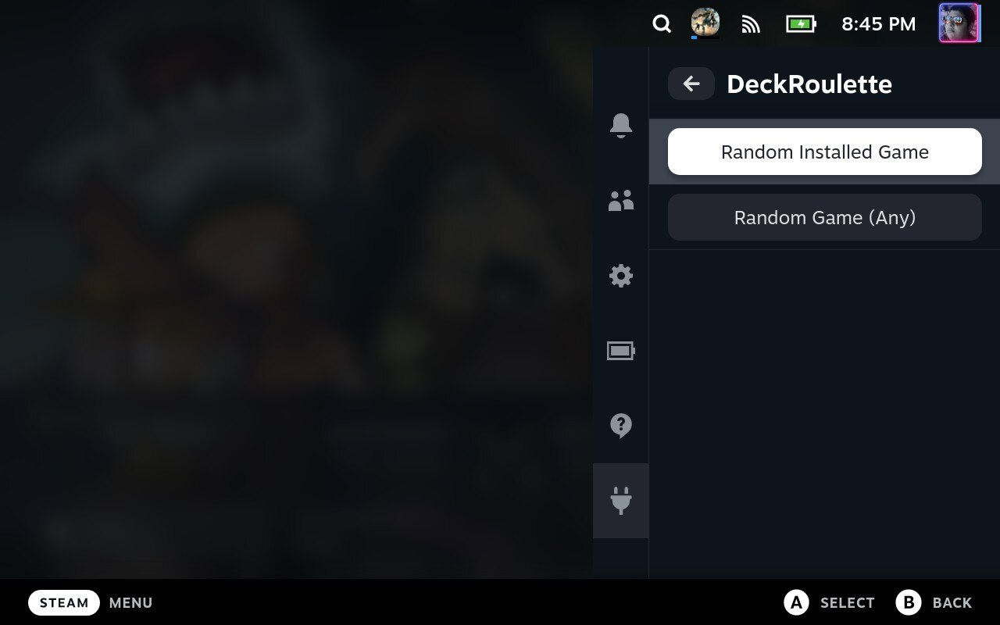

# DeckRoulette

A Decky Loader plugin that opens a randomly selected game from:

- Installed games, including non-Steam games
- Your owned games
- Any individual Steam collection

Collections can be excluded from the broad Installed and My Games pools while
remaining available for their own collection roulette. This is useful for
collections such as EmuDeck's Emulation collection.



## Development

```sh
npx -y pnpm@9.4.0 install --frozen-lockfile
npx -y pnpm@9.4.0 test
npx -y pnpm@9.4.0 build
```
