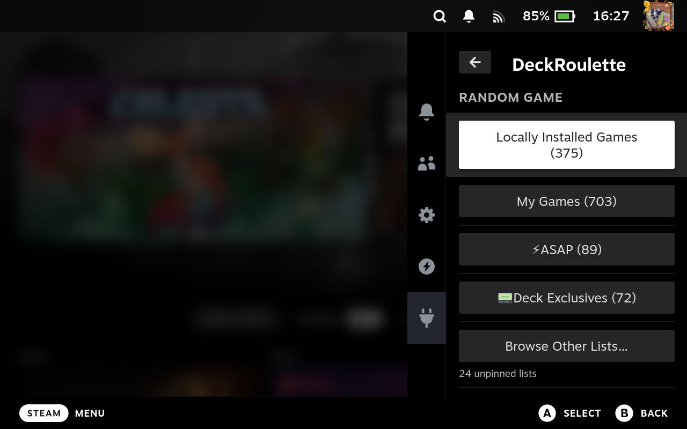
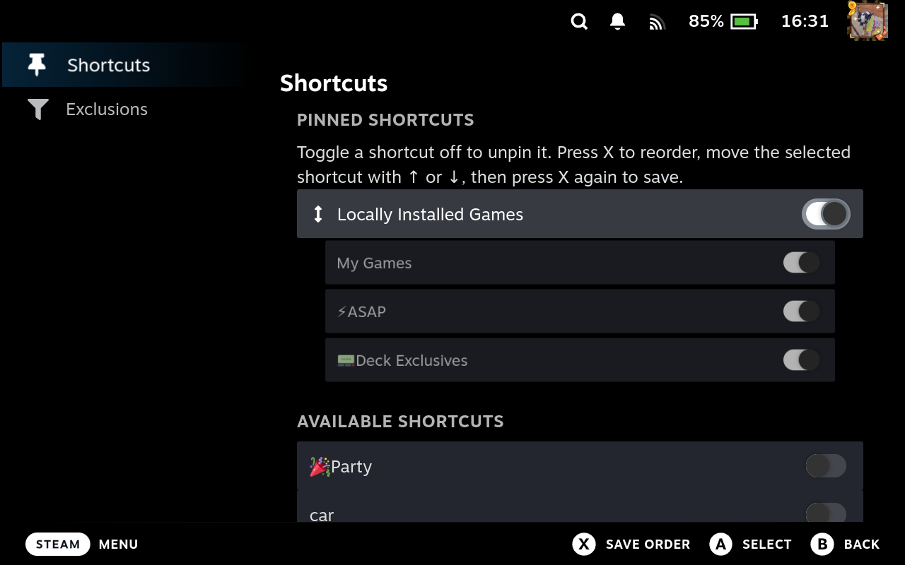
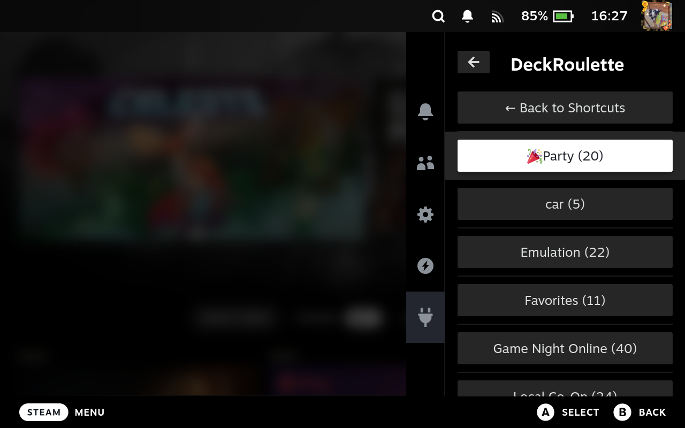

# DeckRoulette

DeckRoulette is a Decky Loader plugin for opening a random game from your
library or Steam collections.



## Highlights

- Pick from locally installed games, including non-Steam games, all owned
  games, or any individual Steam collection.
- Pin the game lists you use most, unpin the defaults, and arrange shortcuts in
  your preferred order.
- Reach every unpinned collection through **Browse Other Lists**, which
  remembers the last list you selected.
- Exclude collections from the broad Installed and My Games pools without
  removing their dedicated roulette shortcuts.
- Navigate entirely by controller, with focus preserved across browsing,
  pinning, and reordering.

## Make Quick Access yours

Installed and My Games are pinned by default. Open **Customize Shortcuts** to
pin collections or remove shortcuts you do not need. Press <kbd>X</kbd> on a
pinned shortcut to enter reorder mode, move it with the D-pad, then press
<kbd>X</kbd> again to save.



## Browse every game list

Unpinned collections stay available under **Browse Other Lists**. DeckRoulette
keeps the last selected list highlighted when you return, so repeating or
changing a roulette choice takes only a button press.



## Collection exclusions

The **Exclusions** page removes selected collections from the combined
Installed and My Games pools. Direct collection roulette remains available,
and eligible game counts update automatically.

## Development

```sh
npx -y pnpm@9.4.0 install --frozen-lockfile
npx -y pnpm@9.4.0 test
npx -y pnpm@9.4.0 build
```
